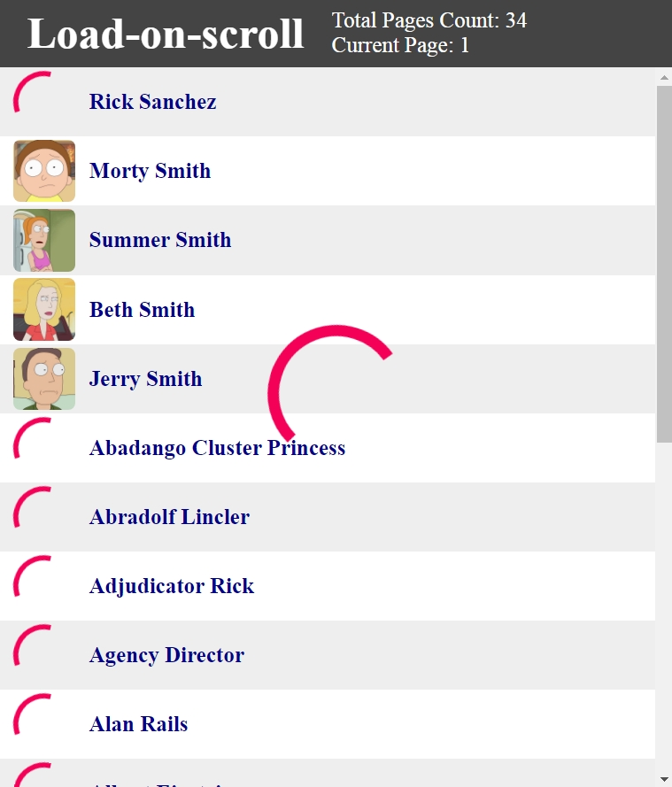
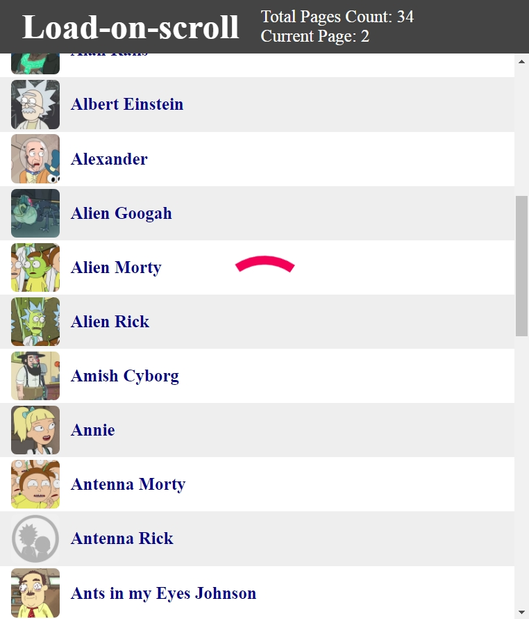

# Load-on-scroll
Ссылка: https://alexaltrex.github.io/Load-on-scroll

## Описание
Подгрузка данных с сервера при прокрутке вертикального списка до конца.

## Запуск проекта:
Для установки и запуска необходимы установленные программы: Node.js, npm, Git
1. Клонирование и запуск: git clone https://github.com/Alexaltrex/Load-on-scroll.git
2. Переход в директорию с проектом: cd Load-on-scroll
3. Установка зависимостей: npm install
4. Запуск проекта в режиме разработки: npm start
5. Перейти в браузер и открыть страницу: http://localhost:3000

## Цель проекта
Приложение отбражает информацию об элементах (в данном случае - персонажи мультфильма "Рик и Морти"). Данные элементов (текст, изображение) загружаются с сервера порциями не более 20 штук и отображаются на странице в виде горизонтального списка с вертикальной прокруткой (в случае необходимости).  
Цель - реализовать подгрузку новой порции данных при прокрутке списка до конца, показать общий пролоадер во время загрузки, для каждого элемента  - прелоадер на месте изображения.    

## Разработка
* Приложение разработано на базе библиотеки React v.17.0.1 с использованием Create React App (https://github.com/facebook/create-react-app)
* Приложение разработано на базе API: 'https://rickandmortyapi.com/api'
* Глобальное состояние: управление - redux v.4.0.5, доступ - react-redux v.7.2.2
* Все компонетны - "глупые", вместо оберток - кастомные хуки
* Локальное состояние: хук "useState"
* Побочные эффекты: хук "useEffect"
* Асинхронный код: redux-thunk v.2.3.0
* Сетевые запросы: axios v.0.21.1
* Стилизация: material-ui v.4.11.2, styled-components v.5.2.1
* Типизация - Typescript v.3.7.2
